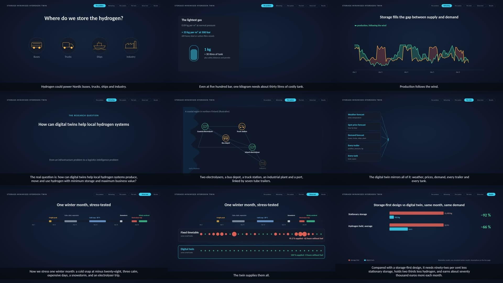
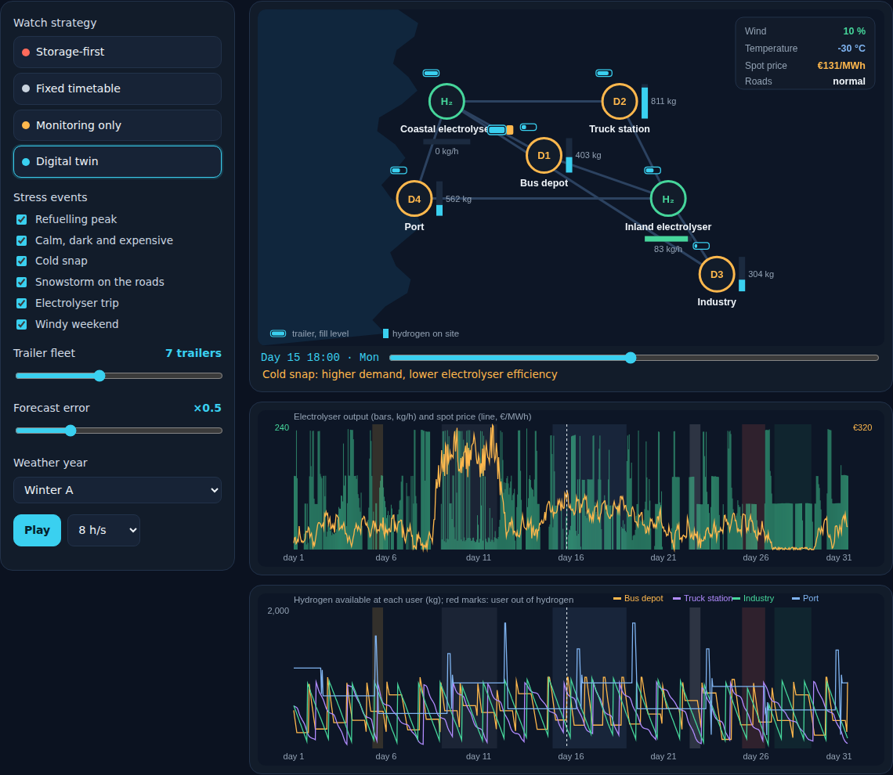

# Storage-Minimised Hydrogen Twin

**Live page:** https://rajan56.github.io/storage-minimised-hydrogen-twin/

**From storage to logistics intelligence: a digital twin for local hydrogen systems in the Nordics.**

> **Research question.** How can digital twins help local hydrogen systems produce, move and use hydrogen with minimum storage and maximum business value?

Hydrogen storage is usually treated as a tank problem: hydrogen is the lightest gas, so every kilogram needs heavy, costly pressure vessels. This project argues that in local systems the deeper problem sits at the ecosystem and strategic level. Producers, hauliers and users each size buffers for their own risk because nobody coordinates the whole chain. In logistics terms, a store is what you build when supply and demand cannot be synchronised. The project reframes storage as a **logistics intelligence problem** and uses a digital twin to show how much stationary storage coordination can replace.



## What is in the repository

| | |
|---|---|
| **Narrated video** (108 s, British English) | The problem, the reframing, the case, the twin, a stress-tested winter month and the results. Every number comes from the simulation. |
| **Live page** | The same simulation running in the browser: a map of the region with trailers moving, charts, a comparison of four operating strategies, stress events you can switch on and off, a minimum-storage frontier and sensitivity runs. |
| **Simulation model** (`sim.js`) | An hourly model of one winter month, identical in the browser and in Node. |



## The case (illustrative)

A stylised coastal region modelled on northern Finland (Northern Ostrobothnia style): wind on the coast, long winters, a city, an industrial park, a port and a main road corridor.

- **Producers:** an 8 MW electrolyser on the coast with a wind power purchase agreement, and a 5 MW grid-connected electrolyser at an inland industrial park.
- **Users:** a depot with 30 fuel-cell buses, a truck refuelling station on the main corridor, an industrial plant, and a port where work vessels bunker 1.1 t twice a week.
- **Logistics:** seven 900 kg tube trailers and three tractors running drop-and-swap trips.
- **Stress events:** a freight peak, three calm and expensive days, a cold snap at about −28 °C, a snowstorm on the roads, an unforeseen electrolyser trip, and a windy weekend with near-zero prices.

## Four ways to run the same hardware

| Strategy | Maturity level | How it works |
|---|---|---|
| Storage-first | – | Three days of tanks at every user and two tonnes at each electrolyser; produce when power is cheaper than last week's average; reorder when a tank is half empty. |
| Fixed timetable | Digital model | Small tanks; steady production and a weekly delivery timetable planned from average demand; a site that runs dry phones in. |
| Monitoring only | Digital shadow | Small tanks; live levels trigger deliveries at a reorder point; no look-ahead. |
| Digital twin | Digital twin | Small tanks; a rolling 48-hour plan from weather, price and demand forecasts. It finds when each user will run short, turns that into departure deadlines using the road forecast and a cold margin, schedules electrolyser hours backwards from those deadlines (cheapest first), and keeps a small reserve on wheels. |

The maturity levels follow the digital model, shadow and twin distinction of Kritzinger et al. (2018).

## Results for the default month

| | Storage-first | Fixed timetable | Monitoring only | Digital twin |
|---|---:|---:|---:|---:|
| Demand supplied | 100 % | 95.2 % | 97.8 % | **100 %** |
| Hours without fuel | 0 | 62 | 48 | **0** |
| Stationary storage | 11,450 kg | 922 kg | 922 kg | **922 kg** |
| Hydrogen held on average | 12,875 kg | 3,634 kg | 4,172 kg | 4,360 kg |
| Average power price paid | €55.4/MWh | €63.5/MWh | €65.3/MWh | €56.1/MWh |
| Cost per kg delivered | €4.94 | €4.37 | €4.54 | **€3.78** |
| Operating margin per month | €438k | €421k | €439k | **€510k** |

Compared with the storage-first design, the twin needs **92 % less stationary storage**, holds **66 % less hydrogen**, delivers at **23 % lower cost per kg**, and earns about **€72k more per month** in this illustrative case. With the same small tanks, the timetable and monitoring strategies leave users without fuel for 62 and 48 hours. Across five different weather years the twin keeps service at or above 99.7 %.

On the **minimum-storage frontier** (live page, section 7), the storage-first design needs about 5.2 t of stationary tanks to reach 99.5 % service; the twin reaches it with its small tanks and a reserve on wheels of a few hundred kilograms.

**What this does not claim.** The data are illustrative, not measured. The twin uses transparent rules rather than a full mathematical optimisation, so its results are a lower bound on what a twin can do. Trailer capacity is itself storage: the claim is not that storage disappears, but that shared, mobile capacity replaces dedicated tanks. Seasonal storage, pipelines and liquid carriers are outside the scope.

## Key assumptions

| Parameter | Value | Basis |
|---|---|---|
| Electrolysers | 8 MW + 5 MW | Assumption |
| System consumption | 55 kWh/kg, +0.3 % per °C below 0 | Typical PEM range (IEA, 2019); cold penalty assumed |
| Compression to 500 bar | 2.5 kWh/kg | Assumption |
| Tube trailer | 900 kg, 50 kg heel | Type IV range 560 to 900 kg (U.S. DOE, n.d.) |
| Fleet | 7 trailers, 3 tractors, 65 km/h | Assumption |
| Demand | about 2.1 t/day | Assumption |
| Power | Spot market plus €8–12/MWh fees; 20 MW wind PPA at €28/MWh | Assumption |
| Stationary storage | €1,000/kg installed, 10 % a year | Assumption |
| Sale price, penalty | €12/kg; €10/kg for unmet demand | Assumption |
| Trucking | €2.4/km + €35 per stop | Assumption |

## Files

```
index.html, style.css, app.js   the live page (plain HTML, CSS, JavaScript; no build step)
sim.js                          the simulation model (browser and Node)
media/
  storage_minimised_hydrogen_twin.mp4   narrated video, 1920 x 1080
  captions.vtt, poster.jpg
video/                          how the video was made
  lines.json                    narration script with scene windows
  voiceover.py                  British English voice (Kokoro offline TTS, voice bm_george) and time map
  export.js                     runs sim.js and exports the numbers the video shows
  animation_src.html            every frame drawn as SVG from the time t
  build.py, render.js           assemble the animation; render with Playwright and ffmpeg
docs/img/                       images for this README
```

Run the model in Node:

```bash
node -e "const S=require('./sim.js'); const w=S.makeWorld({}); for (const s of ['A','B','S','C']) { const r=S.simulate(w,s); console.log(s, (r.service*100).toFixed(2)+' %', r.statKg+' kg', Math.round(r.margin)); }"
```

Rebuild the video:

```bash
cd video
python voiceover.py /path/to/kokoro-model   # voiceover.wav and timemap.json
node export.js                              # data.json from the simulation
python build.py                             # animation.html
node render.js storage_minimised_hydrogen_twin.mp4 timemap.json voiceover.wav
```

## References

Coelho, L. C., Cordeau, J.-F., & Laporte, G. (2014). Thirty years of inventory routing. *Transportation Science, 48*(1), 1–19. https://doi.org/10.1287/trsc.2013.0472

European Parliament and Council of the European Union. (2023). Regulation (EU) 2023/1804 on the deployment of alternative fuels infrastructure. *Official Journal of the European Union, L 234*. https://eur-lex.europa.eu/eli/reg/2023/1804/oj/eng

Gasgrid Finland. (n.d.). *Nordic Hydrogen Route*. Retrieved September 24, 2026, from https://gasgrid.fi/en/hydrogen-development/nordic-hydrogen-route/

Grieves, M., & Vickers, J. (2017). Digital twin: Mitigating unpredictable, undesirable emergent behavior in complex systems. In F.-J. Kahlen, S. Flumerfelt, & A. Alves (Eds.), *Transdisciplinary perspectives on complex systems* (pp. 85–113). Springer. https://doi.org/10.1007/978-3-319-38756-7_4

Hastürk, U., Schrotenboer, A. H., Ursavas, E., & Roodbergen, K. J. (2024). Stochastic cyclic inventory routing with supply uncertainty: A case in green-hydrogen logistics. *Transportation Science, 58*(2), 315–339. https://doi.org/10.1287/trsc.2022.0435

He, G., Mallapragada, D. S., Bose, A., Heuberger, C. F., & Gençer, E. (2021). Hydrogen supply chain planning with flexible transmission and storage scheduling. *IEEE Transactions on Sustainable Energy, 12*(3), 1730–1740. https://doi.org/10.1109/TSTE.2021.3064015

International Energy Agency. (2019). *The future of hydrogen*. IEA. https://www.iea.org/reports/the-future-of-hydrogen

International Energy Agency. (2024). *Global hydrogen review 2024*. IEA. https://www.iea.org/reports/global-hydrogen-review-2024

Kritzinger, W., Karner, M., Traar, G., Henjes, J., & Sihn, W. (2018). Digital twin in manufacturing: A categorical literature review and classification. *IFAC-PapersOnLine, 51*(11), 1016–1022. https://doi.org/10.1016/j.ifacol.2018.08.474

Laurikko, J., Ihonen, J., Kiviaho, J., Himanen, O., Weiss, R., Saarinen, V., Kärki, J., & Hurskainen, M. (2020). *National hydrogen roadmap for Finland*. Business Finland. https://www.businessfinland.fi/4abb35/globalassets/finnish-customers/02-build-your-network/bioeconomy--cleantech/alykas-energia/bf_national_hydrogen_roadmap_2020.pdf

Luo, Y., & Jiao, K. (2018). Cold start of proton exchange membrane fuel cell. *Progress in Energy and Combustion Science, 64*, 29–61. https://doi.org/10.1016/j.pecs.2017.10.003

Papadias, D. D., & Ahluwalia, R. K. (2021). Bulk storage of hydrogen. *International Journal of Hydrogen Energy, 46*(70), 34527–34541. https://doi.org/10.1016/j.ijhydene.2021.08.028

Reuß, M., Grube, T., Robinius, M., Preuster, P., Wasserscheid, P., & Stolten, D. (2017). Seasonal storage and alternative carriers: A flexible hydrogen supply chain model. *Applied Energy, 200*, 290–302. https://doi.org/10.1016/j.apenergy.2017.05.050

Sgarbossa, F., Arena, S., Tang, O., & Peron, M. (2023). Renewable hydrogen supply chains: A planning matrix and an agenda for future research. *International Journal of Production Economics, 255*, Article 108674. https://doi.org/10.1016/j.ijpe.2022.108674

Stöckl, F., Schill, W.-P., & Zerrahn, A. (2021). Optimal supply chains and power sector benefits of green hydrogen. *Scientific Reports, 11*, Article 14191. https://doi.org/10.1038/s41598-021-92511-6

U.S. Department of Energy. (n.d.). *Hydrogen tube trailers*. Retrieved September 24, 2026, from https://www.energy.gov/eere/fuelcells/hydrogen-tube-trailers

Yang, C., & Ogden, J. (2007). Determining the lowest-cost hydrogen delivery mode. *International Journal of Hydrogen Energy, 32*(2), 268–286. https://doi.org/10.1016/j.ijhydene.2006.05.009

## Author

Rajan Kumar V K, D.Sc. (Tech.) in Industrial Engineering and Management (LUT University). Research on performance management with digital twins, AI and IoT, and on digital twins as logistics intelligence in the hydrogen value chain. [LinkedIn](https://www.linkedin.com/in/rajan-kumar-v-k-0a541799/)
